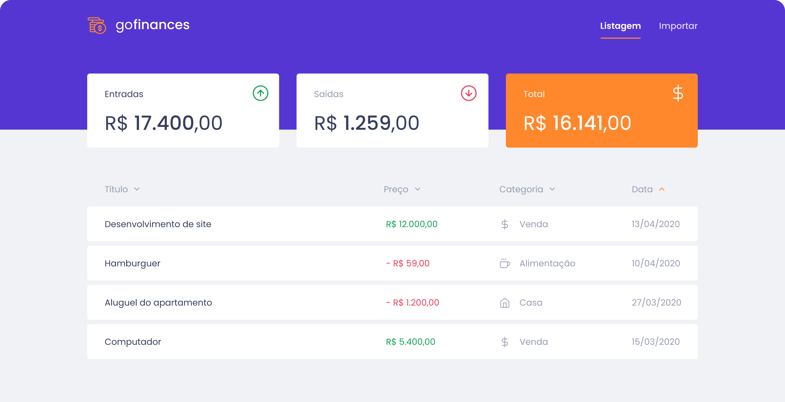

<h1 align="center">Desafio 07</h1>
<p align="center">
  
</p>


<p align="center">
  

  <a href="license.md">
  
  </a>
</p>

___

<h3 align="center">
  <a href="#information_source-sobre">Sobre</a>&nbsp;|&nbsp;
  <a href="#rocket-tecnologias-frameworks-dependencias">Tecnologias</a>&nbsp;|&nbsp;
  <a href="#licença">Licença</a>
</h3>

___

<br>

## :information_source: Sobre

<br>

Continuação do desenvolvimento da aplicação de gestão de transações, a GoFinances.

Essa será uma aplicação que irá se conectar ao seu backend do Desafio 06, e exibir as transações criadas e permitir a importação de um arquivo CSV para gerar novos registros no banco de dados.

<br>

### :pushpin: Preparando o backend

<br>

Antes de tudo, para que o frontend se conecte corretamente ao backend,  incluir o cors no `backend`.

*Instalação*

```bash
yarn add cors

yarn add @types/cors -D
```
Configuração => `app.ts` => **antes da linha que contém app.use(routes)**

```ts
app.use(cors())
```

Além disso, as informações da categoria, devem retornar no seguinte formato:

```json
{
  "id": "c0512e43-6589-4dc8-bd0c-2a3f71b347aa",
  "title": "Loan",
  "type": "income",
  "value": "1500.00",
  "category_id": "d93eccc7-64bb-4268-b825-9200103f3a8b",
  "created_at": "2020-04-20T00:00:49.620Z",
  "updated_at": "2020-04-20T00:00:49.620Z",
  "category": {
    "id": "d93eccc7-64bb-4268-b825-9200103f3a8b",
    "title": "Others",
    "created_at": "2020-04-20T00:00:49.594Z",
    "updated_at": "2020-04-20T00:00:49.594Z"
  }
}
```

Para isso, utilizar a funcionalidade de `eager loading` do *TypeORM*, adicionando o seguinte na sua model de **Transactions**:

```js
@ManyToOne(() => Category, category => category.transaction, { eager: true })
@JoinColumn({ name: 'category_id' })
category: Category;
```

O mesmo deve ser feito na model de **Category**, mas referenciando a tabela de Transaction.

```js
@OneToMany(() => Transaction, transaction => transaction.category)
transaction: Transaction;
```

### :pushpin: Layout da aplicação

<br>

<p align="center">
  
</p>

### :pushpin: Funcionalidades da aplicação

<br>

- **`Listar as transações da sua API`**: Sua página `Dashboard` deve ser capaz de exibir uma listagem através de uma tabela, com o campo `title`, `value`, `type` e `category` de todas as transações que estão cadastradas na sua API.

  **Dica**: Você pode utilizar a função [Intl](https://developer.mozilla.org/pt-BR/docs/Web/JavaScript/Reference/Global_Objects/NumberFormat) para formatar os valores. Dentro da pasta `utils` no template você encontrará um código para te ajudar.

- **`Exibir o balance da sua API`**: Sua página `Dashboard`, você deve exibir o balance que é retornado do seu backend, contendo o total geral, junto ao total de entradas e saídas.

- **`Importar arquivos CSV`**: Na sua página `Import`, você deve permitir o envio de um arquivo no formato `csv` para o seu backend, que irá fazer a importação das transações para o seu banco de dados. O arquivo csv deve seguir o seguinte [modelo](https://github.com/Rocketseat/bootcamp-gostack-desafios/blob/master/desafio-database-upload/assets/file.csv).

  **Dica**: Deixamos disponível um componente chamado `Upload` na pasta `components` para você ter já preparado uma opção de drag-n-drop para o upload de arquivos. PS: Caso você esteja no windows e esteja sofrendo com algum erro ao tentar importar CSV, altere o tipo de arquivo dentro do arquivo `components/upload/index.ts` de `text/csv` para `.csv, application/vnd.ms-excel, text/csv`.

  **Dica 2**: Utilize o [FormData()](https://developer.mozilla.org/pt-BR/docs/Web/API/FormData/FormData) para conseguir enviar o seu arquivo para o seu backend.

### :pushpin: Específicação dos testes

Para esse desafio, temos os seguintes testes:

- **`should be able to list the total balance inside the cards`**: Para que esse teste passe, sua aplicação deve permitir que seja exibido na sua Dashboard, cards contendo o total de `income`, `outcome` e o total da subtração de `income - outcome` que são retornados pelo balance do seu backend.

* **`should be able to list the transactions`**: Para que esse teste passe, sua aplicação deve permitir que sejam listados dentro de uma tabela, toda as transações que são retornadas do seu backend.

  **Dica**: Para a exibição dos valores na listagem de transações, as transações com tipo `income` devem exibir os valores no formado `R$ 5.500,00`. Transações do tipo `outcome` devem exibir os valores no formado `- R$ 5.500,00`.

- **`should be able to navigate to the import page`**: Para que esse teste passe, você deve permitir a troca de página através do Header, pelo botão que contém o nome `Importar`.

  **Dica**: Utilize o componente `Link` que é exportado do `react-router-dom`, passando a propriedade `to` que leva para a página `/import`.

- **`should be able to upload a file`**: Para que esse teste passe, você deve permitir que um arquivo seja enviado através do componente de drag-n-drop na página de `import`, e que seja possível exibir o nome do arquivo enviado para o input.

  **Dica**: Foi disponibilizado um componente chamado `FileList` na pasta `components` para ajudar você a listar os arquivos que enviar pelo componente de `Upload`, ele deve exibir o título do arquivo e o tamanho dele.

<br>

## :rocket: Tecnologias, Frameworks e Dependências

- [ReactJs](https://pt-br.reactjs.org/)
- [TypeScript](https://www.typescriptlang.org/)
- [React-router-dom](https://www.npmjs.com/package/react-router-dom)
- [Styled-components](https://styled-components.com/)
- [Polished](https://github.com/styled-components/polished)
- [Axios](https://www.npmjs.com/package/axios)
- [Eslint](https://eslint.org/)
- [Prettier](https://prettier.io/)

<br>

## Licença

Esse projeto está sob a licença MIT. Veja o arquivo [LICENSE](LICENSE) para mais detalhes.
